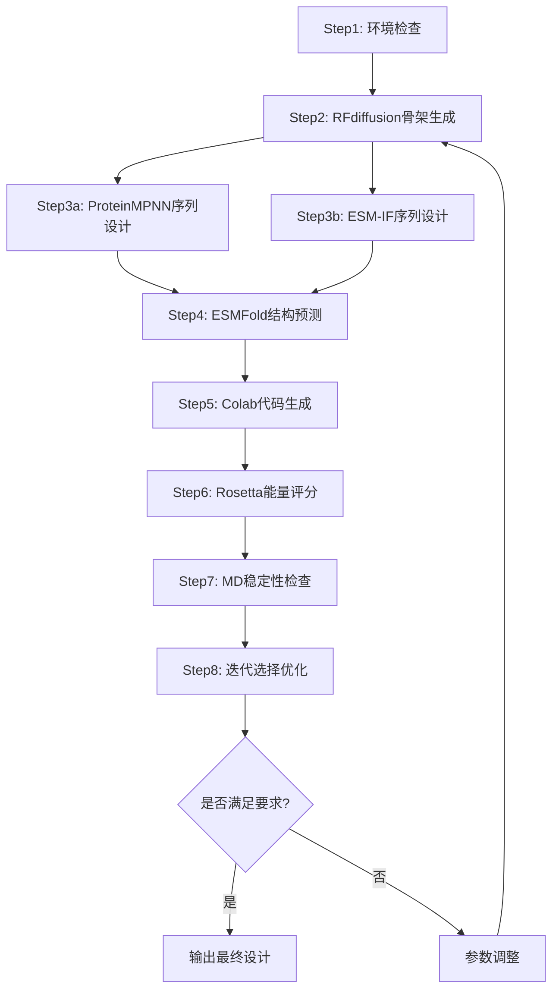
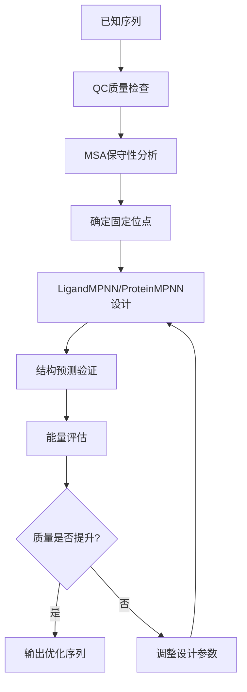

# 蛋白质设计全流程分析平台

**作者**: Kuroneko  
**邮箱**: z2364200290@gmail.com  
**微信公众号**: z2364200290  
**版本**: 1.0.0  
**创建日期**: 2025.5.6  
**最后更新**: 2025.10.6

---

## 目录

1. [项目概述](#项目概述)
2. [整体架构](#整体架构)
3. [核心流程](#核心流程)
4. [详细模块说明](#详细模块说明)
5. [安装与环境配置](#安装与环境配置)
6. [使用指南](#使用指南)
7. [数据库与工具](#数据库与工具)
8. [质量控制与筛选](#质量控制与筛选)
9. [并行处理策略](#并行处理策略)
10. [常见问题与解决方案](#常见问题与解决方案)
11. [技术细节](#技术细节)
12. [引用与致谢](#引用与致谢)

---

## 项目概述

本项目是一个完整的**从头设计蛋白质**的全流程分析平台，集成了从骨架生成到最终验证的各个环节。项目支持两种主要设计路线：

### 设计路线

#### 路线A：从头设计（De Novo Design）
```
Step1: 环境检查 → Step2: RFdiffusion骨架生成 → Step3a: ProteinMPNN序列设计 → Step3b: ESM-IF序列设计 → Step4: ESMFold结构预测 → Step5: Colab代码生成 → Step6: Rosetta能量评分 → Step7: MD稳定性检查 → Step8: 迭代选择优化
```

#### 路线B：已知序列优化（Sequence-based Design）
```
已知序列 → QC分析 → MSA保守性分析 → LigandMPNN/ProteinMPNN → 结构预测 → 验证
```

### 核心功能

- **骨架生成**: 使用RFdiffusion生成蛋白质骨架结构
- **序列设计**: 基于ProteinMPNN/LigandMPNN设计氨基酸序列
- **结构预测**: 使用AlphaFold2/ESMFold预测蛋白质结构
- **能量优化**: 通过Rosetta进行结构优化
- **动力学模拟**: 使用GROMACS进行分子动力学模拟
- **质量控制**: 多维度评估设计质量
- **保守性分析**: MSA分析确定固定位点
- **迭代优化**: 基于反馈的循环改进

---

## 整体架构

```
蛋白质设计平台
├── 骨架生成模块 (RFdiffusion)
├── 序列设计模块 (ProteinMPNN/LigandMPNN)
├── 结构预测模块 (AlphaFold2/ESMFold)
├── 能量优化模块 (Rosetta)
├── 动力学模拟模块 (GROMACS)
├── 质量控制模块 (QC)
├── 保守性分析模块 (MSA)
└── 迭代优化模块
```

### 项目结构

```
F:\Project\蛋白质设计\
├── backbones/                    # RFdiffusion骨架生成
│   ├── colab_rfdiffusion_protein_backbone.py
│   ├── diffusion.txt
│   └── iter1/                       # 生成的骨架文件
├── designs/                      # 序列设计结果
│   ├── AlphaFold2.txt
│   ├── proteinMPNN.txt
│   └── proteinmpnn_design_results/
├── output/                       # 结构预测结果
│   ├── AlphaFold2.ipynb
│   ├── ESMFold.ipynb
│   ├── colab_esmfold_run.py
│   └── prediction_results/
├── QC/                          # 质量控制分析
│   ├── scripts/
│   ├── outputs/
│   └── README.md
├── MSA/                         # 保守性分析
│   ├── step1_download_pdb_extract_sequences.py
│   ├── step2_msa_conservation_analysis.py
│   ├── step3_generate_fixed_positions_json.py
│   └── step1_output/
├── ligandMPNN/                  # 配体感知设计
│   ├── step1_split_pdb.py
│   ├── step2_ligand_md_colab_ready.py
│   └── Protein_ligand.ipynb
├── scripts/                     # 从头设计全流程通用脚本
├── models/                      # 预训练模型
├── json/                        # 配置文件
├── scores/                      # 评分结果
├── logs/                        # 日志文件
├── MD/                          # chatGPT解惑文档
├── config.json                     # 主配置文件
└── requirements.txt                # 依赖包
```

---

## 核心流程

### 路线A：从头设计流程



### 路线B：已知序列优化流程



---

## 详细模块说明

### 1. 环境检查模块 (Step1)

**位置**: `scripts/step1_check_environment.py`

**功能**:
- 检查本地Python 3.9环境和所需依赖包
- 验证所有必要的软件和库是否安装
- 生成环境状态报告

**输入**:
- requirements.txt (pip依赖列表)

**输出**:
- env/environment_status.json (环境检查状态记录)
- logs/step1_YYYYMMDD_HHMMSS.log (检查日志)

**使用方法**:
```bash
python scripts/step1_check_environment.py
```

### 2. 骨架生成模块 (Step2)

**位置**: `scripts/step2_rfdiffusion_backbone.py`

**功能**:
- 生成可下载的RFdiffusion Colab代码文件
- 输入参数后，生成完整的Colab代码
- 可直接复制到Google Colab运行

**输入**:
- 目标长度 (contigs)
- 生成数量 (num_designs)
- 迭代次数 (iterations)
- 对称性设置 (symmetry)

**输出**:
- backbones/colab_rfdiffusion_{name}.py (生成的可执行Colab代码文件)
- {name}.result.zip (Colab自动下载的压缩包)
- backbones/iter1/{name}_*.pdb (骨架文件)

**关键参数**:
```python
contigs = "100"           # 目标长度
num_designs = 20          # 生成数量
iterations = 50           # 迭代次数
symmetry = "none"         # 对称性
```

**使用方法**:
```bash
python scripts/step2_rfdiffusion_backbone.py
```

### 3. 序列设计模块

#### 3.1 ProteinMPNN (Step3a)

**位置**: `scripts/step3a_proteinmpnn_design.py`

**功能**:
- 使用ProteinMPNN对骨架进行序列设计
- 基于ColabDesign封装版本
- 生成多个候选序列

**输入**:
- backbones/iterN/backbone_*.pdb (Step2生成的骨架)
- config.json (全局配置)

**输出**:
- designs/iterN/proteinmpnn_sequences.json (设计的序列)
- designs/iterN/proteinmpnn_colab.py (Colab运行代码)
- logs/step3a_YYYYMMDD_HHMMSS.log (执行日志)

**关键参数**:
```python
num_sequences = 8                    # 序列数量 (1-64)
sampling_temperature = 0.1           # 采样温度 (0.0001-1.0)
remove_amino_acids = "C"             # 禁用的氨基酸
```

**使用方法**:
```bash
python scripts/step3a_proteinmpnn_design.py
```

#### 3.2 ESM-IF (Step3b)

**位置**: `scripts/step3b_esm_if_design.py`

**功能**:
- 使用ESM-IF进行序列设计
- 基于语言模型的序列生成
- 提供替代的序列设计方法

**输入**:
- backbones/iterN/backbone_*.pdb (骨架文件)
- config.json (全局配置)

**输出**:
- designs/iterN/esm_if_sequences.json (ESM-IF设计的序列)
- designs/iterN/esm_if_colab.py (Colab运行代码)

**使用方法**:
```bash
python scripts/step3b_esm_if_design.py
```

#### 2.2 LigandMPNN

**位置**: `ligandMPNN/`

**功能**:
- 配体感知的蛋白质设计
- 自动检测PDB中的配体
- 优化配体结合口袋

**核心优势**:
- **向下兼容**: 无配体时等同于ProteinMPNN
- **配体感知**: 有配体时优化结合界面
- **自动切换**: 根据输入自动选择模式

**输入**:
- PDB文件 (含或不含配体)
- 配体结构文件 (SDF/MOL2)

**输出**:
- 配体结合优化的序列
- 结合亲和力预测

**使用方法**:
```bash
# 检测配体并自动选择模式
python ligandMPNN/step1_split_pdb.py input.pdb
python ligandMPNN/step2_ligand_md_colab_ready.py
```

### 4. 结构预测模块 (Step4)

**位置**: `scripts/step4_esmfold_local_predict.py`

**功能**:
- 对设计的蛋白质序列进行ESMFold结构预测
- 本地运行，无需Colab
- 质量评估和筛选

**输入**:
- designs/iter1/proteinmpnn_sequences.json (ProteinMPNN设计的序列)
- designs/iter1/esm_if_sequences.json (ESM-IF设计的序列)
- output/preds/iter1/esmfold_checkpoint.json (断点续传文件，可选)

**输出**:
- output/preds/iter1/*.pdb (预测结构文件)
- output/preds/iter1/*.json (预测结果和评分)
- output/preds/iter1/esmfold_checkpoint.json (断点续传文件)
- logs/step4_YYYYMMDD_HHMMSS.log (执行日志)

**关键参数**:
```python
batch_size = 4                    # 批次大小
plddt_threshold = 70.0           # pLDDT阈值
ptm_threshold = 0.5              # pTM阈值
max_sequences = 4000             # 最大序列数
```

**使用方法**:
```bash
python scripts/step4_esmfold_local_predict.py
```

### 5. Colab代码生成模块 (Step5)

**位置**: `scripts/step5_generate_colab_snippet.py`

**功能**:
- 生成Colab代码片段
- 为后续分析准备代码
- 支持批量处理

**输入**:
- 预测结果文件
- 配置参数

**输出**:
- Colab代码文件
- 运行脚本

**使用方法**:
```bash
python scripts/step5_generate_colab_snippet.py
```

### 6. 能量评分模块 (Step6)

**位置**: `scripts/step6_rosetta_scoring.py`

**功能**:
- 使用Rosetta能量打分与relax
- 如无Rosetta环境则提供替代评分
- 结构优化和能量评估

**输入**:
- preds/iterN/*.pdb (ESMFold预测结构)
- config.json (全局配置)

**输出**:
- scores/rosetta_scores_iterN.csv (Rosetta能量评分)
- scores/relaxed_structures/ (优化后的结构，可选)
- logs/step6_YYYYMMDD_HHMMSS.log (执行日志)

**关键参数**:
```python
rosetta_relax_rounds = 2          # 优化轮数 (0-5)
scoring_method = 'rosetta'        # 评分方法
max_structures = 50               # 最大处理结构数 (1-500)
```

**使用方法**:
```bash
python scripts/step6_rosetta_scoring.py
```

### 7. 动力学模拟模块 (Step7)

**位置**: `scripts/step7_md_stability_check.py`

**功能**:
- 短时分子动力学模拟稳定性检查
- 如无MD环境则使用简化检查
- 结构稳定性评估

**输入**:
- preds/iterN/*.pdb (预测结构文件)
- scores/rosetta_scores_iterN.csv (可选，Rosetta评分)
- config.json (全局配置)

**输出**:
- scores/md_stability_iterN.csv (MD稳定性分析)
- scores/md_trajectories/ (轨迹文件，可选)
- logs/step7_YYYYMMDD_HHMMSS.log (执行日志)

**关键参数**:
```python
max_md_ns = 10                    # 模拟时长纳秒 (0-1000)
md_method = 'gromacs'             # MD方法
temperature = 300                 # 温度 (250-400K)
top_candidates = 20               # 选择最佳候选进行MD (1-100)
```

**使用方法**:
```bash
python scripts/step7_md_stability_check.py
```

### 8. 迭代选择优化模块 (Step8)

**位置**: `scripts/step8_iterate_and_select.py`

**功能**:
- 综合所有评分进行迭代选择
- 多目标优化和排序
- 生成最终候选列表

**输入**:
- 所有步骤的评分结果
- 配置参数

**输出**:
- 最终优化结果
- 候选序列排序
- 迭代报告

**使用方法**:
```bash
python scripts/step8_iterate_and_select.py
```

### 6. 质量控制模块 (QC)

**位置**: `QC/`

**功能**:
- 序列质量检查
- 结构质量评估
- 多维度评分

**主要脚本**:
- `step1_setup_and_download.py`: 环境设置
- `step2_seq_check_and_seg.py`: 序列检查
- `step3_blast_remote_and_parse.py`: 同源搜索
- `step4_gff_genbank_parse.py`: 注释解析
- `step5_pdb_processing.py`: 结构处理
- `step6_pipeline_driver.py`: 流程驱动

**在整体项目中的作用**:
1. **输入验证**: 检查输入序列的质量和有效性
2. **同源分析**: 识别已知同源蛋白，避免重复设计
3. **结构验证**: 评估预测结构的合理性
4. **质量筛选**: 为后续设计提供质量基准

**后续集成**:
- QC结果可作为ProteinMPNN的约束条件
- 质量评分用于序列筛选
- 同源信息指导设计策略

### 7. 保守性分析模块 (MSA)

**位置**: `MSA/`

**功能**:
- 多序列比对分析
- 保守性位点识别
- 固定位点生成

**主要脚本**:
- `step1_download_pdb_extract_sequences.py`: PDB下载和序列提取
- `step2_msa_conservation_analysis.py`: 保守性分析
- `step3_generate_fixed_positions_json.py`: 固定位点生成

**在整体项目中的作用**:
1. **位点约束**: 为ProteinMPNN提供固定位点信息
2. **功能保护**: 确保关键功能位点不被改变
3. **设计指导**: 基于进化信息指导设计策略

**后续集成**:
- 固定位点JSON直接输入ProteinMPNN
- 保守性评分用于序列筛选
- MSA信息指导设计参数调整

---

## 安装与环境配置

### 系统要求

- **操作系统**: Windows 10/11, Linux, macOS
- **Python**: 3.8+
- **GPU**: NVIDIA GPU (推荐，用于深度学习)
- **内存**: 16GB+ (推荐32GB)
- **存储**: 100GB+ 可用空间

### 环境安装

#### 1. 克隆项目
```bash
git clone <repository_url>
cd 蛋白质设计
```

#### 2. 创建虚拟环境
```bash
# 使用conda
conda create -n protein_design python=3.9
conda activate protein_design

# 或使用venv (推荐，本人Windows 环境python3.14)
python -m venv venv
source venv/bin/activate  # Linux/macOS
# 或
venv\Scripts\activate     # Windows
```

#### 3. 安装依赖
```bash
pip install -r requirements.txt
```

#### 4. 安装专业软件

**GROMACS**:
```bash
python install_md_software.py
```

**Rosetta** (需要许可证):
```bash
# 下载并安装Rosetta
# 配置环境变量
export ROSETTA_HOME=/path/to/rosetta
```

### 配置文件

**主配置文件**: `config.json`
```json
{
  "project_name": "de_novo_protein_design",
  "current_iteration": 1,
  "max_iterations": 10,
  "parameters": {
    "num_backbones": 50,
    "num_sequences_per_backbone": 50,
    "esmfold_pLDDT_threshold": 60.0,
    "max_md_ns": 10
  }
}
```

---

## 使用指南

### 快速开始

#### 路线A：从头设计

1. **环境检查**
```bash
python scripts/step1_check_environment.py
```

2. **生成骨架**
```bash
python scripts/step2_rfdiffusion_backbone.py
# 然后在Google Colab中运行生成的代码
```

3. **序列设计**
```bash
# ProteinMPNN设计
python scripts/step3a_proteinmpnn_design.py
# ESM-IF设计
python scripts/step3b_esm_if_design.py
```

4. **结构预测**
```bash
python scripts/step4_esmfold_local_predict.py
```

5. **Colab代码生成**
```bash
python scripts/step5_generate_colab_snippet.py
```

6. **能量评分**
```bash
python scripts/step6_rosetta_scoring.py
```

7. **动力学模拟**
```bash
python scripts/step7_md_stability_check.py
```

8. **迭代优化**
```bash
python scripts/step8_iterate_and_select.py
```

#### 路线B：已知序列优化

1. **质量检查**
```bash
python QC/scripts/step1_setup_and_download.py
python QC/scripts/step2_seq_check_and_seg.py
```

2. **保守性分析**
```bash
python MSA/step1_download_pdb_extract_sequences.py
python MSA/step2_msa_conservation_analysis.py
python MSA/step3_generate_fixed_positions_json.py
```

3. **序列设计**
```bash
# 使用LigandMPNN (自动检测配体)
python ligandMPNN/step1_split_pdb.py input.pdb
python ligandMPNN/step2_ligand_md_colab_ready.py
```

### 详细使用步骤

#### 步骤1：环境准备
```bash
# 检查环境
python -c "import torch; print(torch.cuda.is_available())"

# 验证安装
python QC/scripts/step7_utils.py
```

#### 步骤2：数据准备
```bash
# 准备输入数据
mkdir input_data
# 将PDB文件放入input_data/
# 将序列文件放入input_data/
```

#### 步骤3：运行分析
```bash
# 选择路线并运行
# 路线A: 从头设计
python run_de_novo_design.py

# 路线B: 序列优化
python run_sequence_optimization.py
```

---

## 数据库与工具

### 主要数据库

| 数据库 | 用途 | 网址 | 访问方式 |
|--------|------|------|----------|
| **RCSB PDB** | 蛋白质结构 | https://www.rcsb.org/ | API/下载 |
| **UniProt** | 蛋白质序列 | https://www.uniprot.org/ | API |
| **AlphaFold DB** | 预测结构 | https://alphafold.ebi.ac.uk/ | API |
| **HH-suite** | 同源搜索 | https://github.com/soedinglab/hh-suite | 本地安装 |
| **ChEMBL** | 化合物信息 | https://www.ebi.ac.uk/chembl/ | API |

### 在线工具

| 工具 | 功能 | 网址 | 使用场景 |
|------|------|------|----------|
| **ColabFold** | 结构预测 | https://colab.research.google.com/ | 快速预测 |
| **ESMFold** | 结构预测 | https://esmatlas.com/ | 无MSA预测 |
| **AlphaFold** | 结构预测 | https://colab.research.google.com/ | 高精度预测 |
| **ChimeraX** | 结构可视化 | https://www.cgl.ucsf.edu/chimerax/ | 结构分析 |

### 软件工具

| 软件 | 版本 | 安装方式 | 用途 |
|------|------|----------|------|
| **GROMACS** | 2023.x | conda/源码 | 分子动力学 |
| **Rosetta** | 3.13+ | 官网下载 | 结构优化 |
| **HHblits** | 3.3.0+ | conda | 同源搜索 |
| **PyMOL** | 2.5+ | conda | 结构可视化 |

---

## 质量控制与筛选

### 多维度评分体系

#### 1. 序列质量评分

**QC模块评分**:
- **序列长度**: 目标长度 ± 10%
- **氨基酸组成**: 标准20种氨基酸比例
- **低复杂度区域**: SEG算法检测
- **同源性**: BLAST搜索相似性

**评分标准**:
```python
sequence_score = {
    'length_score': 0.3,      # 长度合理性
    'composition_score': 0.2,  # 氨基酸组成
    'complexity_score': 0.2,   # 复杂度
    'homology_score': 0.3      # 同源性
}
```

#### 2. 结构质量评分

**AlphaFold2/ESMFold评分**:
- **pLDDT**: 局部置信度 (0-100)
- **pTM**: 预测模板建模 (0-1)
- **PAE**: 预测对齐误差

**评分阈值**:
```python
structure_thresholds = {
    'plddt_min': 70.0,        # 最小pLDDT
    'ptm_min': 0.6,           # 最小pTM
    'pae_max': 5.0,           # 最大PAE
    'high_confidence_ratio': 0.8  # 高置信度残基比例
}
```

#### 3. 能量评分

**Rosetta评分**:
- **总能量**: 结构稳定性
- **结合自由能**: 配体结合亲和力
- **Ramachandran**: 二面角合理性

**GROMACS评分**:
- **RMSD**: 结构稳定性
- **RMSF**: 柔性分析
- **氢键**: 氢键网络完整性

### 筛选策略

#### 第一轮：快速筛选
```python
def quick_filter(sequences):
    """快速筛选：基于序列和基础结构评分"""
    filtered = []
    for seq in sequences:
        if (seq.plddt > 60 and 
            seq.ptm > 0.5 and 
            seq.length_score > 0.7):
            filtered.append(seq)
    return filtered
```

#### 第二轮：详细评估
```python
def detailed_evaluation(sequences):
    """详细评估：包含能量和动力学分析"""
    evaluated = []
    for seq in sequences:
        # Rosetta能量计算
        rosetta_score = calculate_rosetta_energy(seq)
        
        # GROMACS动力学
        md_results = run_md_simulation(seq)
        
        # 综合评分
        total_score = combine_scores(seq, rosetta_score, md_results)
        
        if total_score > threshold:
            evaluated.append(seq)
    
    return evaluated
```

#### 第三轮：最终筛选
```python
def final_selection(sequences):
    """最终筛选：基于多目标优化"""
    # 多目标优化
    pareto_front = multi_objective_optimization(sequences)
    
    # 专家评分
    expert_scores = expert_evaluation(pareto_front)
    
    # 最终排序
    final_ranking = rank_by_expert_score(expert_scores)
    
    return final_ranking[:top_n]
```

### ProteinMPNN筛选机制

**内部筛选**:
1. **序列概率**: 基于模型置信度
2. **结构兼容性**: 与骨架的匹配度
3. **氨基酸偏好**: 基于训练数据

**外部筛选**:
1. **结构预测**: AlphaFold2/ESMFold验证
2. **能量计算**: Rosetta能量评估
3. **动力学模拟**: GROMACS稳定性测试

---

## 并行处理策略

### 多级并行架构

#### 1. 任务级并行

**骨架生成并行**:
```python
# 并行生成多个骨架
from multiprocessing import Pool

def generate_backbone_parallel(contigs_list):
    with Pool(processes=4) as pool:
        results = pool.map(generate_single_backbone, contigs_list)
    return results
```

**序列设计并行**:
```python
# 并行设计多个序列
def design_sequences_parallel(backbones):
    with Pool(processes=8) as pool:
        sequences = pool.map(design_single_sequence, backbones)
    return sequences
```

#### 2. 数据级并行

**批次处理**:
```python
# ESMFold批次预测
def batch_predict_structures(sequences, batch_size=4):
    batches = [sequences[i:i+batch_size] 
               for i in range(0, len(sequences), batch_size)]
    
    results = []
    for batch in batches:
        batch_result = esmfold_predict(batch)
        results.extend(batch_result)
    
    return results
```

#### 3. GPU并行

**多GPU训练**:
```python
# 使用多GPU进行结构预测
import torch

def multi_gpu_predict(sequences):
    if torch.cuda.device_count() > 1:
        model = torch.nn.DataParallel(model)
    
    results = model(sequences)
    return results
```

### 并行执行路线

#### 路线1：完全并行
```bash
# 同时运行多个独立任务
python run_parallel.py --mode=full_parallel --workers=8
```

#### 路线2：流水线并行
```bash
# 流水线式处理
python run_pipeline.py --mode=pipeline --stages=4
```

#### 路线3：混合并行
```bash
# 结合任务和数据并行
python run_hybrid.py --task_workers=4 --data_workers=2
```

### 资源管理

**CPU资源**:
```python
# 动态调整CPU使用
import psutil

def adjust_cpu_usage():
    cpu_count = psutil.cpu_count()
    optimal_workers = min(cpu_count - 1, 8)
    return optimal_workers
```

**内存管理**:
```python
# 内存监控和清理
import gc

def memory_cleanup():
    gc.collect()
    if torch.cuda.is_available():
        torch.cuda.empty_cache()
```

**存储优化**:
```python
# 临时文件管理
import tempfile
import shutil

def manage_temp_files():
    temp_dir = tempfile.mkdtemp()
    # 使用临时目录
    # 完成后清理
    shutil.rmtree(temp_dir)
```

---

## 常见问题与解决方案

### 安装问题

#### Q1: CUDA版本不匹配
**问题**: `RuntimeError: CUDA runtime error`
**解决方案**:
```bash
# 检查CUDA版本
nvidia-smi

# 安装匹配的PyTorch版本
pip install torch torchvision torchaudio --index-url https://download.pytorch.org/whl/cu118
```

#### Q2: 依赖包冲突
**问题**: `ImportError: cannot import name`
**解决方案**:
```bash
# 创建新的虚拟环境
conda create -n protein_design_new python=3.9
conda activate protein_design_new

# 重新安装依赖
pip install -r requirements.txt
```

### 运行问题

#### Q3: 内存不足 (OOM)
**问题**: `RuntimeError: CUDA out of memory`
**解决方案**:
```python
# 减小批次大小
batch_size = 2  # 从4减小到2

# 使用梯度累积
accumulation_steps = 2

# 清理GPU缓存
torch.cuda.empty_cache()
```

#### Q4: 序列过长
**问题**: ESMFold无法处理长序列
**解决方案**:
```python
# 分段预测
def predict_long_sequence(sequence, max_length=400):
    if len(sequence) <= max_length:
        return predict_single(sequence)
    else:
        # 分段处理
        segments = split_sequence(sequence, max_length)
        results = []
        for segment in segments:
            result = predict_single(segment)
            results.append(result)
        return merge_results(results)
```

### 结果问题

#### Q5: 预测结构质量差
**问题**: pLDDT < 50
**解决方案**:
1. **检查输入序列**:
   ```python
   # 验证序列质量
   if sequence_quality_score < 0.7:
       print("序列质量不佳，请检查输入")
   ```

2. **调整参数**:
   ```python
   # 增加迭代次数
   iterations = 100  # 从50增加到100
   
   # 使用更好的MSA
   use_msa = True
   ```

3. **尝试不同模型**:
   ```python
   # 使用AlphaFold2替代ESMFold
   model = "alphafold2"
   ```

#### Q6: 设计序列不理想
**问题**: 序列评分低
**解决方案**:
1. **调整ProteinMPNN参数**:
   ```python
   temperature = 0.05  # 降低温度，增加确定性
   num_sequences = 100  # 增加生成数量
   ```

2. **使用固定位点**:
   ```python
   # 基于MSA分析设置固定位点
   fixed_positions = load_conservation_analysis()
   ```

3. **迭代优化**:
   ```python
   # 多轮设计
   for iteration in range(5):
       sequences = design_sequences(backbone, fixed_positions)
       best_sequence = select_best(sequences)
       fixed_positions = update_constraints(best_sequence)
   ```

### 性能问题

#### Q7: 运行速度慢
**解决方案**:
1. **使用GPU加速**:
   ```python
   device = torch.device("cuda" if torch.cuda.is_available() else "cpu")
   model = model.to(device)
   ```

2. **并行处理**:
   ```python
   # 使用多进程
   from multiprocessing import Pool
   with Pool(processes=4) as pool:
       results = pool.map(process_sequence, sequences)
   ```

3. **缓存结果**:
   ```python
   # 缓存中间结果
   import pickle
   
   def cache_result(key, result):
       with open(f"cache/{key}.pkl", "wb") as f:
           pickle.dump(result, f)
   ```

#### Q8: 存储空间不足
**解决方案**:
1. **清理临时文件**:
   ```bash
   # 清理临时文件
   find . -name "*.tmp" -delete
   find . -name "__pycache__" -type d -exec rm -rf {} +
   ```

2. **压缩结果文件**:
   ```python
   import zipfile
   
   def compress_results(output_dir):
       with zipfile.ZipFile("results.zip", "w") as zipf:
           for file in os.listdir(output_dir):
               zipf.write(os.path.join(output_dir, file))
   ```

3. **选择性保存**:
   ```python
   # 只保存高质量结果
   if score > threshold:
       save_result(result)
   else:
       delete_result(result)
   ```

---

## 技术细节

### 核心算法

#### 1. RFdiffusion算法
**原理**: 基于扩散模型的蛋白质骨架生成
**关键组件**:
- **噪声调度**: 逐步添加噪声到蛋白质结构
- **去噪网络**: 学习从噪声中恢复蛋白质结构
- **条件生成**: 支持长度、对称性等约束

**实现细节**:
```python
def rfdiffusion_forward(noise_schedule, backbone_model, conditions):
    # 噪声调度
    t = sample_timestep(noise_schedule)
    
    # 添加噪声
    noisy_structure = add_noise(clean_structure, t)
    
    # 去噪预测
    predicted_noise = backbone_model(noisy_structure, t, conditions)
    
    # 更新结构
    updated_structure = update_structure(noisy_structure, predicted_noise, t)
    
    return updated_structure
```

#### 2. ProteinMPNN算法
**原理**: 基于图神经网络的序列设计
**关键组件**:
- **图编码器**: 将蛋白质结构编码为图表示
- **序列解码器**: 基于图表示生成氨基酸序列
- **注意力机制**: 捕获长程相互作用

**实现细节**:
```python
def proteinmpnn_forward(structure_graph, fixed_positions=None):
    # 图编码
    node_features = graph_encoder(structure_graph)
    
    # 序列解码
    sequence_logits = sequence_decoder(node_features)
    
    # 应用固定位点约束
    if fixed_positions:
        sequence_logits = apply_fixed_positions(sequence_logits, fixed_positions)
    
    # 采样序列
    sequence = sample_sequence(sequence_logits)
    
    return sequence
```

#### 3. ESMFold算法
**原理**: 基于Transformer的端到端结构预测
**关键组件**:
- **序列编码器**: 将氨基酸序列编码为表示
- **结构解码器**: 从序列表示预测3D结构
- **自注意力**: 捕获序列内的长程依赖

**实现细节**:
```python
def esmfold_forward(sequence):
    # 序列编码
    sequence_embeddings = sequence_encoder(sequence)
    
    # 结构预测
    structure_coords = structure_decoder(sequence_embeddings)
    
    # 置信度计算
    confidence_scores = confidence_head(sequence_embeddings)
    
    return structure_coords, confidence_scores
```

### 数据结构

#### 1. 蛋白质结构表示
```python
class ProteinStructure:
    def __init__(self):
        self.atoms = []          # 原子坐标
        self.residues = []       # 残基信息
        self.chains = []         # 链信息
        self.sequence = ""       # 氨基酸序列
        self.coordinates = None  # 坐标矩阵
```

#### 2. 序列设计结果
```python
class DesignResult:
    def __init__(self):
        self.sequence = ""       # 设计的序列
        self.structure = None    # 预测结构
        self.scores = {}         # 各种评分
        self.metadata = {}       # 元数据
```

#### 3. 质量控制指标
```python
class QualityMetrics:
    def __init__(self):
        self.plddt = 0.0         # 局部置信度
        self.ptm = 0.0           # 预测模板建模
        self.pae = None          # 预测对齐误差
        self.rosetta_score = 0.0 # Rosetta能量
        self.md_stability = 0.0  # 动力学稳定性
```

### 性能优化

#### 1. 内存优化
```python
# 使用内存映射
import numpy as np

def load_large_structure(file_path):
    # 内存映射大文件
    structure = np.memmap(file_path, dtype='float32', mode='r')
    return structure

# 批量处理
def process_sequences_batch(sequences, batch_size=32):
    for i in range(0, len(sequences), batch_size):
        batch = sequences[i:i+batch_size]
        yield process_batch(batch)
```

#### 2. 计算优化
```python
# 使用JIT编译
from numba import jit

@jit(nopython=True)
def fast_distance_calculation(coords1, coords2):
    # 快速距离计算
    return np.sqrt(np.sum((coords1 - coords2)**2, axis=1))

# 使用GPU加速
import cupy as cp

def gpu_accelerated_calculation(data):
    # 将数据移到GPU
    gpu_data = cp.asarray(data)
    
    # GPU计算
    result = cp.linalg.norm(gpu_data, axis=1)
    
    # 移回CPU
    return cp.asnumpy(result)
```

#### 3. 存储优化
```python
# 使用压缩存储
import h5py
import zlib

def save_compressed_results(results, file_path):
    with h5py.File(file_path, 'w') as f:
        # 压缩存储
        f.create_dataset('results', data=results, 
                        compression='gzip', compression_opts=9)
```

---

## 引用与致谢

### 主要工具引用

#### 深度学习模型
```bibtex
@article{watson2022broadly,
  title={Broadly applicable and accurate protein design by integrating structure prediction networks and diffusion generative models},
  author={Watson, Joseph L and Juergens, David and Bennett, Nathaniel R and Trippe, Brian L and Yim, Jason and Eisenach, Helen E and Ahern, Woody and Borst, Andrew J and Ragotte, Robert J and Milles, Lukas F and others},
  journal={bioRxiv},
  year={2022}
}

@article{dauparas2022robust,
  title={Robust deep learning--based protein sequence design using ProteinMPNN},
  author={Dauuparas, Justas and Anishchenko, Ivan and Bennett, Nathaniel and Bai, Hua and Ragotte, Robert J and Milles, Lukas F and Wicky, Basile IM and Courbet, Alexis and de Haas, Rob J and Bethel, Neville and others},
  journal={Science},
  volume={378},
  number={6615},
  pages={49--56},
  year={2022}
}

@article{lin2023evolutionary,
  title={Evolutionary-scale prediction of atomic-level protein structure with a language model},
  author={Lin, Zeming and Akin, Halil and Rao, Roshan and Hie, Brian and Zhu, Zhongkai and Lu, Wenting and Smetanin, Nikita and Verkuil, Robert and Kabeli, Ori and Shmueli, Yaron and others},
  journal={Science},
  volume={379},
  number={6637},
  pages={1123--1130},
  year={2023}
}
```

#### 结构预测工具
```bibtex
@article{jumper2021highly,
  title={Highly accurate protein structure prediction with AlphaFold},
  author={Jumper, John and Evans, Richard and Pritzel, Alexander and Green, Tim and Figurnov, Michael and Ronneberger, Olaf and Tunyasuvunakool, Kathryn and Bates, Russ and {\v{Z}}{\'\i}dek, Augustin and Potapenko, Anna and others},
  journal={Nature},
  volume={596},
  number={7873},
  pages={583--589},
  year={2021}
}

@article{mirdita2022colabfold,
  title={ColabFold: making protein folding accessible to all},
  author={Mirdita, Milot and Sch{\"u}tze, Konstantin and Moriwaki, Yoshitaka and Heo, Lim and Ovchinnikov, Sergey and Steinegger, Martin},
  journal={Nature methods},
  volume={19},
  number={6},
  pages={679--682},
  year={2022}
}
```

#### 分子动力学
```bibtex
@article{abraham2015gromacs,
  title={GROMACS: High performance molecular simulations through multi-level parallelism from laptops to supercomputers},
  author={Abraham, Mark James and Murtola, Teemu and Schulz, Roland and P{\'a}ll, Szil{\'a}rd and Smith, Jeremy C and Hess, Berk and Lindahl, Erik},
  journal={SoftwareX},
  volume={1},
  pages={19--25},
  year={2015}
}
```

#### 结构优化
```bibtex
@article{alquraishi2019alphafold,
  title={AlphaFold at CASP13},
  author={AlQuraishi, Mohammed},
  journal={Bioinformatics},
  volume={35},
  number={22},
  pages={4862--4865},
  year={2019}
}
```

### 数据库引用

```bibtex
@article{burley2019rcsb,
  title={RCSB Protein Data Bank: biological macromolecular structures enabling research and education in fundamental biology, biomedicine, biotechnology and energy},
  author={Burley, Stephen K and Berman, Helen M and Bhikadiya, Charmi and Bi, Chunxiao and Chen, Li and Costanzo, Luigi Di and Christie, Cole and Duarte, Jose M and Dutta, Shuchismita and Feng, Zukang and others},
  journal={Nucleic acids research},
  volume={47},
  number={D1},
  pages={D464--D474},
  year={2019}
}

@article{uniprot2019uniprot,
  title={UniProt: a worldwide hub of protein knowledge},
  author={UniProt Consortium},
  journal={Nucleic acids research},
  volume={47},
  number={D1},
  pages={D506--D515},
  year={2019}
}
```

### 致谢

本项目得到了以下开源项目和社区的支持：

- **RFdiffusion团队**: 提供了优秀的蛋白质骨架生成工具
- **ProteinMPNN团队**: 开发了强大的序列设计算法
- **ESMFold团队**: 提供了快速的结构预测工具
- **AlphaFold团队**: 开创了AI结构预测的新时代
- **GROMACS社区**: 提供了高质量的分子动力学软件
- **Rosetta社区**: 提供了强大的结构优化工具

### 许可证

本项目遵循MIT许可证。使用本项目时，请遵守相关工具和数据库的许可证要求。

---

## 联系方式

**作者**: Kuroneko  
**邮箱**: z2364200290@gmail.com  
**微信公众号**: z2364200290  

如有问题或建议，欢迎通过以上方式联系。

---

## 更新日志

### v1.0.0 (2025.10.6)
- 完成完整的蛋白质设计流程
- 集成RFdiffusion骨架生成
- 集成ProteinMPNN/LigandMPNN序列设计
- 集成AlphaFold2/ESMFold结构预测
- 集成Rosetta能量优化
- 集成GROMACS动力学模拟
- 完成QC质量控制模块
- 完成MSA保守性分析模块
- 支持并行处理和批量操作
- 提供详细的使用文档

### 计划更新
- 集成更多结构预测工具
- 添加更多质量控制指标
- 优化并行处理性能
- 添加Web界面
- 支持更多输入格式

---

**感谢使用蛋白质设计全流程分析平台！**

*本项目旨在推动蛋白质设计领域的发展，为科研工作者提供强大的工具支持。*
